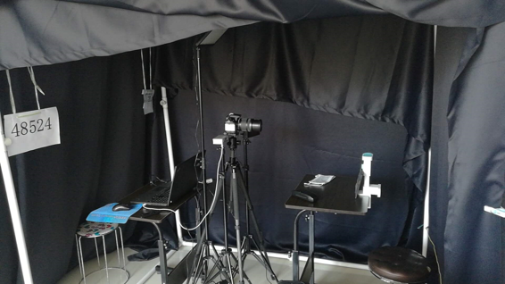
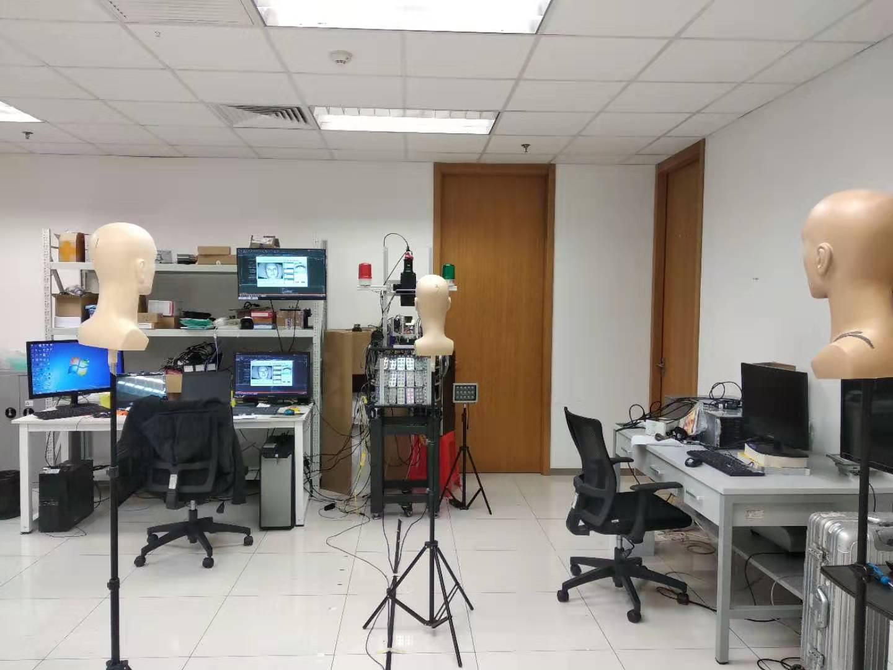

## Introduction

Iris is considered one of the most accurate and reliable biometric modality. Iris is more stable and distinctive compared with fingerprint, face, voice, etc, and difficult to be replicated for spoof attacks. Although an iris pattern is naturally an ideal identifier, the development of a high-performance iris recognition algorithm and transferring it from research lab to practical applications is still a challenging task. In practical applications, the iris recognition system must face various unpredictable iris image degraded. For example, recognition of low-quality iris images, non-cooperative iris images, long-range iris images, and moving iris images are all huge problems in iris recognition. We believe that the first step in solving these problems is to design and develop a database of iris images that includes all of these degraded.

## Brief Descriptions and Statistics of the Database

CASIA-Iris-Complex contains totally 22,932 images from 292 Asian subjects. It includes two subsets: CASIA-Iris-CX1 and CASIA-Iris-CX2. All images were collected under NIR illumination and two eyes were captured simultaneously. Detailed information of each subset is shown below.

| Subset Characteristics |         CASIA-Iris-CX1          |        CASIA-Iris-CX2        |
| :--------------------: | :-----------------------------: | :--------------------------: |
|         Sensor         |         Canon EOS 1300D         | MindVision    MV-SUF1200GM-T |
|      Environment       | Indoor with   brightness change |            Indoor            |
|    No. of subjects     |               255               |              37              |
|     No. of classes     |               510               |              73              |
|     No. of images      |              18785              |             4147             |
|       Resolution       |           4608\*3456            |           640\*480           |
|         Format         |              jpeg               |             bmp              |
|        Distance        |             0\.75m              |           1m,3m,5m           |
|         Object         |          Partial face           |             Eye              |

<!-- ### CASIA-Iris-CX1

CASIA-Iris-CX1 was designed to research destortion caused by subject such as pupil dilation, strabismus, and occlusion. Partial face images were captured with a modified Canon EOS 1300D camera which Infrared cut-off filters was changed by Infrared passing filters. All collection work was finished indoors, and both visible light source and near-infrared light source are used for illumination.

For pupil dilation, we change the brightness of ambient light (within safe range) to stimulate pupil variety. Visible light changes can not recorded by modified cameras, so the brightness of the image is constant. In addition, we also collected images of natural light sources. Due to the long continent period, the environment includes noon, dusk, sunny and cloudy.

For strabismus, we placed five targets behind the camera, respectively at the left, top left, top, top right, and right positions. Looking at these targets will cause a squint of about 45 degrees.

For occlusion, we require volunteers to wear glasses. During the acquisition process, the near-infrared light source is randomly moved to generate light spot. Meanwhile some glasses also have stains on the surface to occlude iris. Another type of occlusion comes from the person being collected. We asked the person to actively squint or close their eyes and take images of these states. We noticed a more interesting problem is that for some elderly people, their eyelids will naturally sag, resulting in very serious occlusion, which is a huge challenge that has to be faced.

In addition, both defocus and motion blur are inevitable during the acquisition process, and we retain these images for research on related issues.

### CASIA-Iris-CX2

Distant mainly explores the problems of iris recognition in long distance situations. We use our own long-range iris acquisition device, which can collect high-resolution iris images at a distance of 1-6m. The acquisition environment and acquisition equipment are shown below.

This device includes a lens that can quickly zoom within a certain range, so it can take continuous zoom images, that is, a sequence of images from blurred to clear to blurred, which can be used for research on the determination and enhancement of blurred images.
We note that one of the difficulties in long-range iris recognition is near-infrared illumination. The position of the target in long-distant iris recognition is uncertain, and it is difficult for the near-infrared light source placed adjacent to the camera to make the target accurately exposed. To this end, we have taken some over-exposed and under-exposed images, hoping to solve this practical problem. Specifically, we did not really adjust the intensity of the light source, but simulated the problem by changing the camera exposure time (8ms ~ 35ms), so that the exposure time can be used to quantitatively describe the degree of exposure.
In addition, considering that the target has a lower degree of cooperation in long-range iris recognition, we also require the subject to achieve the effect of squinting by moving the head and rotating the eyeball. -->

## Database Organization

The file name of each image in CASIA-Iris-Complex is unique to each other and denotes some useful properties associated with the image such as subject ID, left/right eye, image ID etc.

- The images of CASIA-Iris-CX1 are stored as: AAAA_B_Y_Y_CD_DDD.jpg
  - AAAA: the unique identifier of the subject in the subset.
  - B: '1' denotes left eye and '2' denotes right eye.
  - CC: represent the acquisition conditions.
    - '2x' represents brightness, where x is between 0-4, means 'natural light', 'dark', 'weak', 'medium', and 'strong' brightness.
    - '3x' represents the direction of thr person looks at, where x is between 1-4,  means left-up, right-up, right-down, left-down.
    - '40' and '41' represents squinting and closing eyes.
    - '5x' represents occlusion, where x is the occlusion type, and the value is between 1-3, which in turn means that the hand covers the face, wears a mask, and wears glasses
  - DDD: the index of the image in the same scenarios

- The images of CASIA-Iris-CX1 are stored as: AAAA_B_CD_TTTTTTTTTT.jpg
  - AAAA: the unique identifier of the subject in the subset.
  - B: '1' denotes left eye and '2' denotes right eye.
  - C: the acquisition distance, and the value is between 1-5.
  - D: the acquisition conditions.
    - '1' denotes normal;
    - '2' denotes lens zoom;
    - '3' denotes exposure time changes
    - '4' denotes turning eyes;
    - '5' denotes turning head;
  - TTTTTTTTTT: the timestamp of this image.

## Copyright Note and Contacts

The database is released for research and educational purposes. We hold no liability for any undesirable consequences of using the database. All rights of the CASIA database are reserved. Any person or organization is not permitted to distribute, publish, copy, or disseminate this database. In all documents and papers that report experimental results based on this database, our efforts in constructing the database should be acknowledged such as “Portions of the research in this paper use the CASIA-Iris-Complex-V1.0 collected by the Chinese Academy of Sciences' Institute of Automation (CASIA)”.