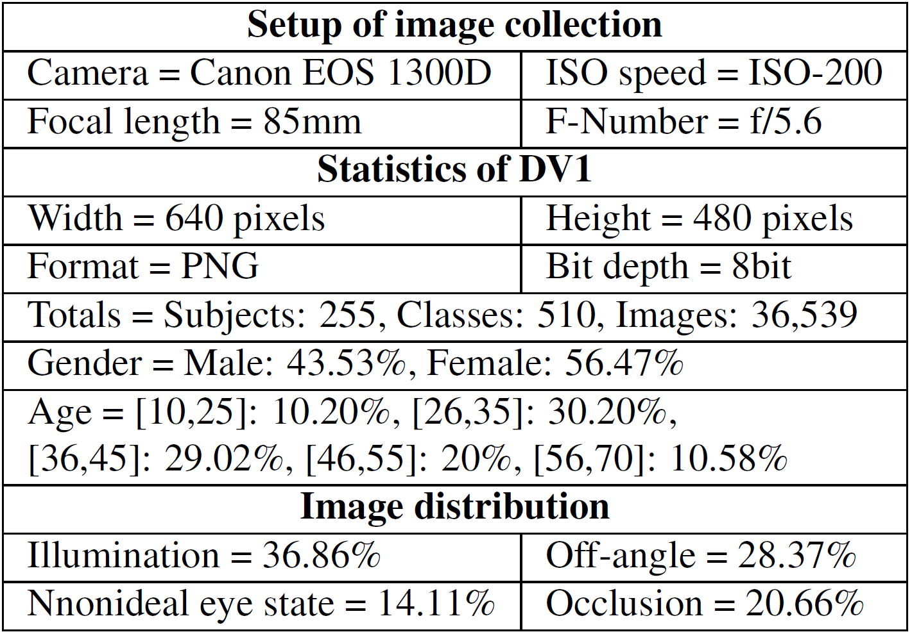
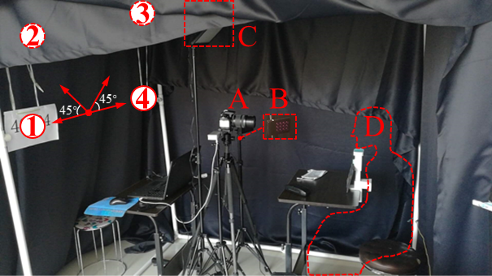
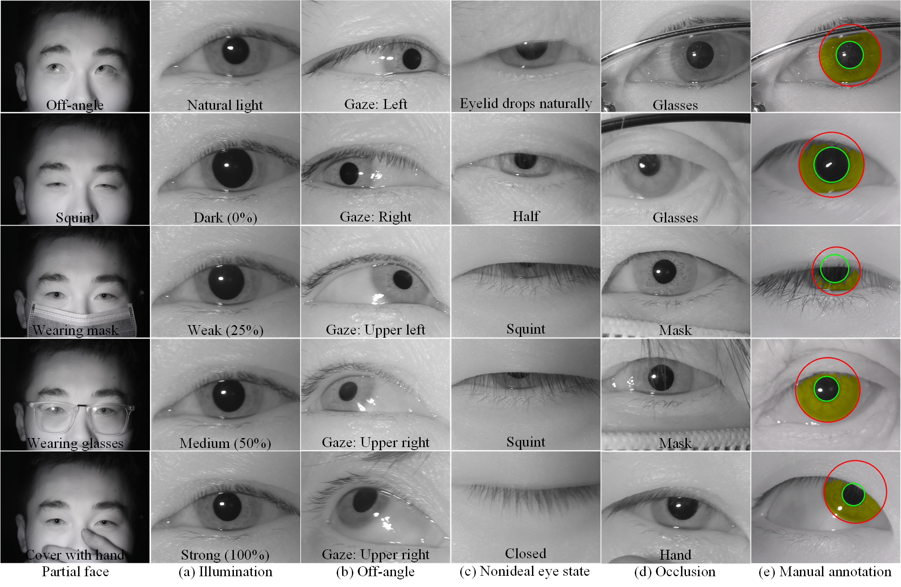

## Introduction

Since the outbreak of the COVID-19 pandemic, iris recognition has been used increasingly as contactless and unaffected by face masks. Although less user cooperation is an urgent demand for existing systems, corresponding manually annotated databases could hardly be obtained. This work presents a large-scale database of near-infrared iris images named CASIA-Iris-Degradation Version 1.0 (DV1), which consists of 15 subsets of various degraded images, simulating less cooperative situations such as illumination, off-angle, occlusion, and nonideal eye state. A lot of open-source segmentation and recognition methods are compared comprehensively on the DV1 using multiple evaluations, and the best among them are exploited to conduct ablation studies on each subset. Experimental results show that even the best deep learning frameworks are not robust enough on the database, and further improvements are recommended for challenging factors such as half-open eyes, off-angle, and pupil dilation. Therefore, we publish the DV1 with manual annotations online to promote iris recognition.

## Description of CASIA-Iris-Degradation

CASIA-Iris-Degradation contains 36,539 images from 255 Asian people. All images were collected under NIR illumination and two eyes were captured simultaneously. Details of the proposed database are shown in the table below.

### Setup of image collection

As shown in the figure below, we built a collection room using black-out cloth. The curtain on one side of the room can be opened and closed artificially to control the natural light. 
Inside, there were camera (A), light sources (B, C), volunteer (D), and four directional markers (1-4).
Each volunteer was asked to sit down, put their chin on the holder (0.75 m from the camera), keep their head as still as possible, and move their eyes according to instructions.
To simulate the off-angle situation, the subject was required to look along a set of directions indicated by four markers in the visual field, while in other cases look straight ahead (i.e., the midpoint of marker 1 and 4).

### Statistics of the proposed database

To simulate real image degradation, the proposed database is divided into four categories, and each of them is separated into three to five subsets as follows:

#### Illumination

The intensity of the VW light source was adjusted to four levels: Dark (0\%), Weak (25\%), Medium (50\%), Strong (100\%) to change the pupil size. 
In addition, images under natural light were also collected (with Dark level). 
Note that the intensity in other categories was set to the Medium level by default.

#### Off-angle

There are four directions: (1) Left, (2) Upper left, (3) Upper right, (4) Right. 
The left and right are in the horizontal direction, while the upper left and right angles are both 45 degrees.

#### Nonideal eye state

Since it is difficult to keep eyes open all the time, we collected images of closed, squinted, and half-open eyes. 
Although most images of the former two classes have no effective iris region and are accompanied by blur, they can be used to train eye state detectors for fatigue driving detection or other relevant scenarios.

#### Occlusion

For occlusion, volunteers were required to wear glasses, masks and using a hand to cover the mouth and nose. During this section, the NIR light source was randomly moved slightly to generate light spots. Meanwhile, some glasses also had stains on the surface to occlude the iris.
An unexpected observation is that for some elderly volunteers, their eyelids droop naturally, resulting in severe occlusion, which should arouse more attention.

More samples and annotations are presented below.

## Copyright Note and Contacts

The database is released for research and educational purposes. We hold no liability for any undesirable consequences of using the database. All rights of the CASIA-Iris-Degradation database are reserved. Any person or organization is not permitted to distribute, publish, copy, or disseminate this database. In all documents and papers that report experimental results based on this database, our efforts in constructing the database should be acknowledged such as "Portions of the research in this paper use the CASIA-Iris-Degradation-V1.0 collected by the Chinese Academy of Sciences' Institute of Automation (CASIA)".

To receive a copy of the database, you can apply for it on our [BIT website](http://www.idealtest.org/#/datasetDetail/26)