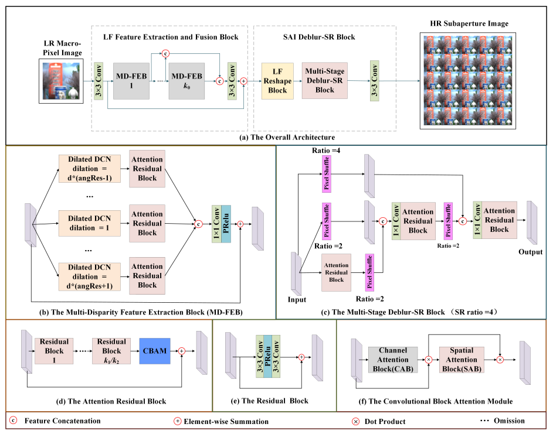

## 1. AIF-LFNet: All-in-Focus Light Field Super-Resolution Method Considering the Depth-Varying Defocus

> Shubo Zhou, Liang Hu, Yunlong Wang, Zhenan Sun, Kunbo Zhang, Xue-qin Jiang. "AIF-LFNet: All-in-Focus Light Field Super-Resolution Method Considering the Depth-Varying Defocus". Transactions on Circuits and Systems for Video Technology
> 
> <https://ieeexplore.ieee.org/stamp/stamp.jsp?tp=&arnumber=10018388>

As an aperture-divided computational imaging system, microlens array (MLA) -based light field (LF) imaging is playing an increasingly important role in computer vision. As the trade-off between the spatial and angular resolutions, deep learning (DL) -based image super-resolution (SR) methods have been applied to enhance the spatial resolution. However, in existing DL-based methods, the depth-varying defocus is not considered both in dataset development and algorithm design, which restricts many applications such as depth estimation and object recognition. To overcome this shortcoming, a super-resolution task that reconstructs all-in-focus high-resolution (HR) LF images from low-resolution (LR) LF images is proposed by designing a large dataset and proposing a convolutional neural network (CNN) -based SR method. The dataset is constructed by using Blender software, consisting of 150 light field images used as training data, and 15 light field images used as validation and testing data. The proposed network is designed by proposing the dilated deformable convolutional network (DCN) -based feature extraction block and the LF subaperture image (SAI) Deblur-SR block. The experimental results demonstrate that the proposed method achieves more appealing results both quantitatively and qualitatively.
