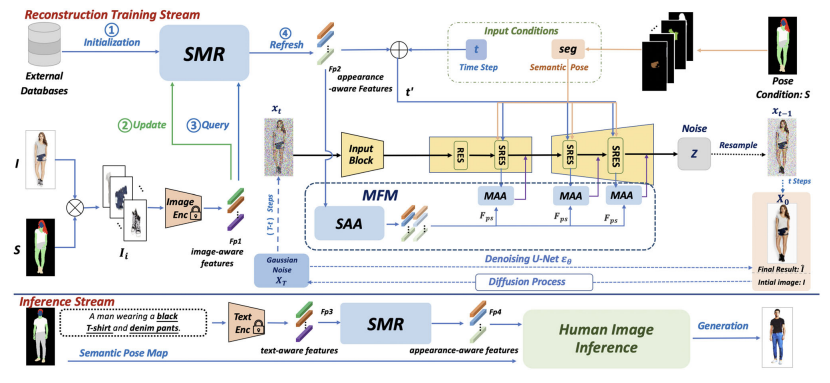

## 1. Open-Vocabulary Text-Driven Human Image Generation

> Kaiduo Zhang, Muyi Sun, Jianxin Sun, Kunbo Zhang, Zhenan Sun, Tieniu Tan. "Open-Vocabulary Text-Driven Human Image Generation". 2024 International Journal of Computer Vision.
> 
> <https://link.springer.com/article/10.1007/s11263-024-02079-7>

Generating human images from open-vocabulary text descriptions is an exciting but challenging task. Previous methods (i.e., Text2Human) face two challenging problems: (1) they cannot well handle the open-vocabulary setting by arbitrary text inputs (i.e., unseen clothing appearances) and heavily rely on limited preset words (i.e., pattern styles of clothing appearances); (2) the generated human image is inaccuracy in open-vocabulary settings. To alleviate these drawbacks, we propose a flexible diffusion-based framework, namely HumanDiffusion, for open-vocabulary text-driven human image generation (HIG). The proposed framework mainly consists of two novel modules: the Stylized Memory Retrieval (SMR) module and the Multi-scale Feature Mapping (MFM) module. Encoded by the vision-language pretrained CLIP model, we obtain coarse features of the local human appearance. Then, the SMR module utilizes an external database that contains clothing texture details to refine the initial coarse features. Through SMR refreshing, we can achieve the HIG task with arbitrary text inputs, and the range of expression styles is greatly expanded. Later, the MFM module embedding in the diffusion backbone can learn fine-grained appearance features, which effectively achieves precise semantic-coherence alignment of different body parts with appearance features and realizes the accurate expression of desired human appearance. The seamless combination of the proposed novel modules in HumanDiffusion realizes the freestyle and high accuracy of text-guided HIG and editing tasks. Extensive experiments demonstrate that the proposed method can achieve state-of-the-art (SOTA) performance, especially in the open-vocabulary setting.
