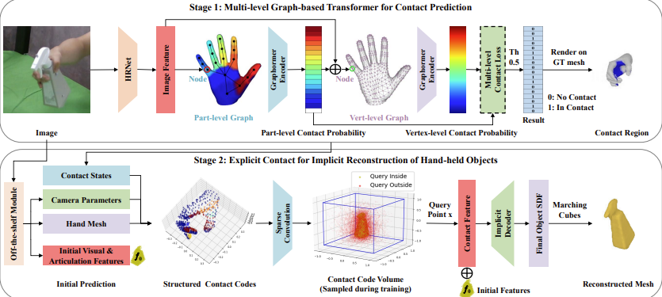

## 1. Learning Explicit Contact for Implicit Reconstruction of Hand-held Objects from Monocular Images

> Junxing Hu,Hongwen Zhang,Zerui Chen,Mengcheng Li,Yunlong Wang,Yebin Liu,Zhenan Sun. Learning Explicit Contact for Implicit Reconstruction of Hand-held Objects from Monocular Images. The Association for the Advancement of Artificial Intelligence.
> 
> <https://arxiv.org/abs/2305.20089>

Reconstructing hand-held objects from monocular RGB images is an appealing yet challenging task. In this task, contacts between hands and objects provide important cues for recovering the 3D geometry of the hand-held objects. Though recent works have employed implicit functions to achieve impressive progress, they ignore formulating contacts in their frameworks, which results in producing less realistic object meshes. In this work, we explore how to model contacts in an explicit way to benefit the implicit reconstruction of hand-held objects. Our method consists of two components: explicit contact prediction and implicit shape reconstruction. In the first part, we propose a new subtask of directly estimating 3D hand-object contacts from a single image. The part-level and vertex-level graph-based transformers are cascaded and jointly learned in a coarse-to-fine manner for more accurate contact probabilities. In the second part, we introduce a novel method to diffuse estimated contact states from the hand mesh surface to nearby 3D space and leverage diffused contact probabilities to construct the implicit neural representation for the manipulated object. Benefiting from estimating the interaction patterns between the hand and the object, our method can reconstruct more realistic object meshes, especially for object parts that are in contact with hands. Extensive experiments on challenging benchmarks show that the proposed method outperforms the current state of the arts by a great margin. Our code is publicly available at https://junxinghu.github.io/projects/hoi.html.
